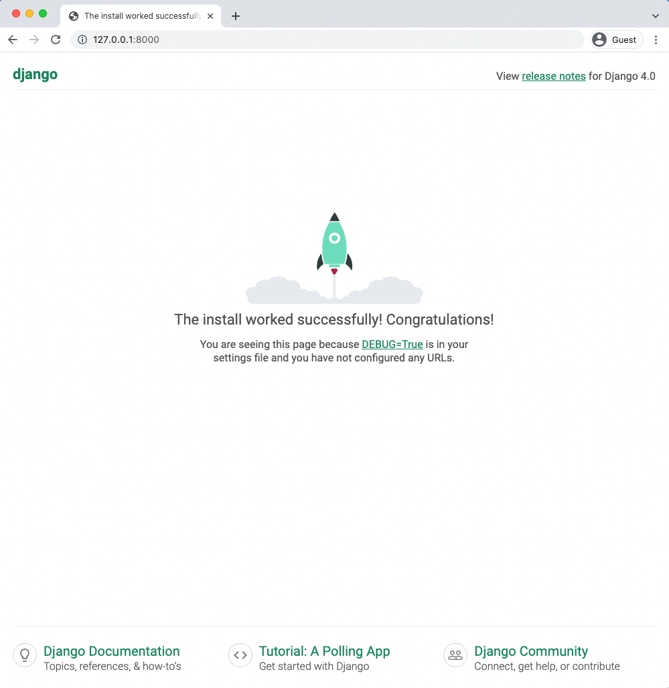

# Blog App
## Table of Content

- [Initial Set Up](#initialsetup)
- [Database Models](#databasemodels)
- [Admin](#admin)
- [URL's](#urls)
- [Views](#views)
- [Templates](#templates)
- [Static Files](#staticfiles)
- [Individual Blog Pages](#inividualblogpages)
- [Test](#test)


## Initial set up
Our steps for setting up a new Django project are as follows:
- Make a new directory for our code called blog
- Install Django in a new virtual environment called .venv
- Create a new Django project called django_project
- Create a new app blog
- Cerform a migration to set up the database
- Update django_project/settings.py

Let’s implement them now in a new command line terminal.

```bash
# Windows
> cd onedrive\desktop\code #our project dir
> mkdir blog
> cd blog
> python -m venv .venv
> .venv\Scripts\Activate.ps1
(.venv) > python -m pip install django~=4.0.0
(.venv) > django-admin startproject django_project .
(.venv) > python manage.py startapp blog
(.venv) > python manage.py migrate
```

To ensure Django knows about our new app, open your text editor and add the new app to INSTALLED_APPS in the django_project/settings.py file:
```python
# django_project/settings.py
INSTALLED_APPS = [
    "django.contrib.admin",
    "django.contrib.auth",
    "django.contrib.contenttypes",
    "django.contrib.sessions",
    "django.contrib.messages",
    "django.contrib.staticfiles",
    "blog.apps.BlogConfig",  # new
]
```
Spin up the local server using the runserver command.
```bash
(.venv) > python manage.py runserver
```
If you navigate to http://127.0.0.1:8000/ in your web browser you should see the friendly Django welcome page.

Ok, initial installation complete! Next we’ll create our database model for blog posts.
## Database Models
What are the characteristics of a typical blog application? In our case, let’s keep things simple and assume each post has a title, author, and body. We can turn this into a database model by opening the blog/models.py file and entering the code below:

```python
# blog/models.py
from django.db import models
from django.urls import reverse


class Post(models.Model):
    title = models.CharField(max_length=200)
    author = models.ForeignKey(
        "auth.User",
        on_delete=models.CASCADE,
    )
    body = models.TextField()

    def __str__(self):
        return self.title

    def get_absolute_url(self):
        return reverse("post_detail", kwargs={"pk": self.pk})
```

At the top, we’re importing the class models and the handy utility function [reverse](https://docs.djangoproject.com/en/4.0/ref/urlresolvers/#reverse) that allows us to reference an object by its URL template name. More on this shortly.

Next we create a subclass of models.Model called Post which provides access to everything within [django.db.models.Models](https://docs.djangoproject.com/en/4.0/topics/db/models/). Then we can add additional fields and methods as desired.

Our model has three fields: title which is limited to the length to 200 characters; body which uses a TextField to automatically expand as needed to fit the user’s text, and an author [ForeignKey](https://docs.djangoproject.com/en/4.0/ref/models/fields/#django.db.models.ForeignKey) that allows for a many-to-one relationship. This means that a given user can be the author of many different blog posts but not the other way around. The reference is to the built-in User model that Django provides for authentication. For all many-to-one relationships such as a ForeignKey we must also specify an [on delete](https://docs.djangoproject.com/en/4.0/ref/models/fields/#django.db.models.ForeignKey.on_delete) option.

A __str__ method is added to provide a human-readable version of the model in the admin or Django shell. And we also add a get_absolute_url method, which we haven’t seen before, that tells Django how to calculate the canonical URL for our model object. It says to use the URL named post_detail and pass in the pk. More on this later as we build out our blog app.

Now that our new database model is created we need to create a new migration record for it and migrate the change into our database. Stop the server with Control+c. This two-step process can be completed with the commands below:
```bash
(.venv) > python manage.py makemigrations blog
(.venv) > python manage.py migrate
```
Our database is configured! What’s next?

## Admin
We need a way to access our data. Enter the Django admin! First, create a superuser account by typing the command below and following the prompts to set up an email and password. Note that when typing your password, it will not appear on the screen for security reasons.
```bash
(.venv) > python manage.py createsuperuser
Username (leave blank to use 'wsv'): wsv
Email:
Password:
Password (again):
Superuser created successfully.
```
Now start running the Django server again with the command python manage.py runserver and navigate over to the admin at 127.0.0.1:8000/admin/. Log in with your new superuser account.

Oops! Where’s our new Post model? We forgot to update blog/admin.py so let’s do that now.
```python
# blog/admin.py
from django.contrib import admin
from .models import Post

admin.site.register(Post)
```
If you refresh the page you’ll see the update.


Let’s add two blog posts so we have some sample data to work with. Click on the + Add button next to Posts to create a new entry. Make sure to add an “author” to each post too since by default all model fields are required.

Now that our database model is complete we need to create the necessary views, URLs, and templates so we can display the information on our web application.

## URL's
We want to display our blog posts on the homepage so, as in previous chapters, we’ll first configure our django_project/urls.py file and then our app-level blog/urls.py file to achieve this.

In your text editor, create a new file called urls.py within the blog app and update it with the code below.

```python
# blog/urls.py
from django.urls import path
from .views import BlogListView

urlpatterns = [
    path("", BlogListView.as_view(), name="home"),
]
```
We’re importing our soon-to-be-created views at the top. The empty string, "", tells Python to match all values and we make it a named URL, home, which we can refer to in our views later on. While it’s optional to add a named URL it’s a best practice you should adopt as it helps keep things organized as your number of URLs grows.

We also should update our django_project/urls.py file so that it knows to forward all requests directly to the blog app.

```python
# django_project/urls.py
from django.contrib import admin
from django.urls import path, include  # new

urlpatterns = [
    path("admin/", admin.site.urls),
    path("", include("blog.urls")),  # new
]
```
We’ve added include on the second line and a URL pattern using an empty string regular expression, "", indicating that URL requests should be redirected as is to blog’s URLs for further instructions.

## Views

We’re going to use class-based views but if you want to see a function-based way to build a blog application, I highly recommend the Django Girls Tutorial. It is excellent.

In our views file, add the code below to display the contents of our Post model using ListView.

```python
# blog/views.py
from django.views.generic import ListView
from .models import Post


class BlogListView(ListView):
    model = Post
    template_name = "home.html"
```

On the top two lines we import ListView and our database model Post. Then we subclass ListView and add links to our model and template. This saves us a lot of code versus implementing it all from scratch.

## Templates
With our URLs and views now complete, we’re only missing the third piece of the puzzle: templates. As we already saw in Chapter 4, we can inherit from other templates to keep our code clean. Thus we’ll start off with a base.html file and a home.html file that inherits from it. Then later when we add templates for creating and editing blog posts, they too can inherit from base.html.

Start by creating our new templates directory.

In your text editor, create two new template files within it called templates/base.html and templates/home.html.

Then update django_project/settings.py so Django knows to look there for our templates.

```python
# django_project/settings.py
TEMPLATES = [
    {
        ...
        "DIRS": [BASE_DIR / "templates"],  # new
        ...
    },
]
```
And update the base.html template as follows.

```html
<!-- templates/base.html -->
<html>
  <head>
    <title>Django blog</title>
  </head>
  <body>
    <header>
      <h1><a href="">Django blog</a></h1>
    </header>
    <div>
      
      
    </div>
  </body>
</html>
```
Note that code between  and  can be filled by other templates. Speaking of which, here is the code for home.html.

```html
<!-- templates/base.html -->
<!-- templates/home.html -->




  <div class="post-entry">
    <h2><a href="">{{ post.title }}</a></h2>
    <p>{{ post.body }}</p>
  </div>


```

At the top, we note that this template extends base.html and then wrap our desired code with content blocks. We use the Django Templating Language to set up a simple for loop for each blog post. Note that post_list comes from ListView and contains all the objects in our view of the model post.

If you start the Django server again with python manage.py runserver and refresh the homepage we can see it is working.


## Static Files
We need to add some CSS to our project to improve the styling. CSS, JavaScript, and images are a core piece of any modern web application and within the Django world are referred to as “static files.” Django provides tremendous flexibility around how these files are used, but this can lead to quite a lot of confusion for newcomers.

By default, Django will look within each app for a folder called static. In other words, a folder called blog/static/. If you recall, this is similar to how templates are treated as well.

As Django projects grow in complexity over time and have multiple apps, it is often simpler to reason about static files if they are stored in a single, project-level directory instead. That is the approach we will take here.

Quit the local server with Control+c and create a new directory called static in the same folder as the manage.py file.

Then we need to tell Django to look for this new folder when loading static files. If you look at the bottom of the django_project/settings.py file, there is already a single line of configuration:

```python
# django_project/settings.py
STATIC_URL = "/static/"
STATICFILES_DIRS = [BASE_DIR / "static"]  # new
```
By configuring STATICFILES_DIRS, we can tell Django where to look for static files beyond just app/static folder. In your django_project/settings.py file, at the bottom, add the following new line which tells Django to look within our newly-created static folder for static files.

Next create a css directory within static.

In your text editor, create a new file within this directory called static/css/base.css.

What should we put in our file? How about changing the title to be red?

```css
/* static/css/base.css */
header h1 a {
  color: red;
}
```
Last step now. We need to add the static files to our templates by adding  to the top of base.html. Because our other templates inherit from base.html, we only have to add this once. Include a new line at the bottom of the <head></head> code that explicitly references our new base.css file.

```html
<!-- templates/base.html -->

<html>
  <head>
    <title>Django blog</title>
    <link rel="stylesheet" href="">
  </head>
  ...
```

Phew! That was a bit of a pain but it’s a one-time hassle. Now we can add static files to our static directory and they’ll automatically appear in all our templates.

Start up the server again with python manage.py runserver and look at our updated homepage at http://127.0.0.1:8000/.

Even with this new styling we can still do a little better. How about if we add a custom font and some more CSS? Since this book is not a tutorial on CSS simply insert the following between <head></head> tags to add Source Sans Pro, a free font from Google.

```html
<!-- templates/base.html -->

<html>
<head>
  <title>Django blog</title>
  <link href="https://fonts.googleapis.com/css?family=Source+Sans+Pro:400"
    rel="stylesheet">
  <link href="" rel="stylesheet">
</head>
  ...
```
Then update our css file by copy and pasting the following code:

```css
/* static/css/base.css */
body {
  font-family: 'Source Sans Pro', sans-serif;
  font-size: 18px;
}

header {
  border-bottom: 1px solid #999;
  margin-bottom: 2rem;
  display: flex;
}

header h1 a {
  color: red;
  text-decoration: none;
}

.nav-left {
  margin-right: auto;
}

.nav-right {
  display: flex;
  padding-top: 2rem;
}

.post-entry {
  margin-bottom: 2rem;
}

.post-entry h2 {
  margin: 0.5rem 0;
}

.post-entry h2 a,
.post-entry h2 a:visited {
  color: blue;
  text-decoration: none;
}

.post-entry p {
  margin: 0;
  font-weight: 400;
}

.post-entry h2 a:hover {
  color: red;
}
```
## Individual Blog Pages
Now we can add the functionality for individual blog pages. How do we do that? We need to create a new view, url, and template. I hope you’re noticing a pattern in development with Django now!

Start with the view. We can use the generic class-based DetailView to simplify things. At the top of the file, add DetailView to the list of imports and then create a new view called BlogDetailView.

```python
# blog/views.py
from django.views.generic import ListView, DetailView  # new
from .models import Post


class BlogListView(ListView):
    model = Post
    template_name = "home.html"


class BlogDetailView(DetailView):  # new
    model = Post
    template_name = "post_detail.html"
```
In this new view, we define the model we’re using, Post, and the template we want it associated with, post_detail.html. By default, DetailView will provide a context object we can use in our template called either object or the lowercased name of our model, which would be post. Also, DetailView expects either a primary key or a slug passed to it as the identifier. More on this shortly.

In your text editor create a new template file for a post detail called templates/post_detail.html. Then type in the following code:

```html
<!-- templates/post_detail.html -->



<div class="post-entry">
  <h2>{{ post.title }}</h2>
  <p>{{ post.body }}</p>
</div>

```
At the top we specify that this template inherits from base.html. Then display the title and body from our context object, which DetailView makes accessible as post.

Personally, I found the naming of context objects in generic views extremely confusing when first learning Django. Because our context object from DetailView is either our model name post or object we could also update our template as follows and it would work exactly the same.

```html
<!-- templates/post_detail.html -->



<div class="post-entry">
  <h2>{{ object.title }}</h2>
  <p>{{ object.body }}</p>
</div>

```
If you find using post or object confusing it is possible to explicitly name the context object in our view using context_object_name.

The “magic” naming of the context object is a price you pay for the ease and simplicity of using generic views, which are great if you know what they’re doing but take a little research in the official documentation to customize.

Ok, what’s next? How about adding a new URL path for our view, which we can do as follows.

```python
# blog/urls.py
from django.urls import path
from .views import BlogListView, BlogDetailView  # new

urlpatterns = [
    path("post/<int:pk>/", BlogDetailView.as_view(), name="post_detail"),  # new
    path("", BlogListView.as_view(), name="home"),
]
```

All blog post entries will start with post/. Next is the primary key for our post entry which will be represented as an integer, <int:pk>. What’s the primary key you’re probably asking? Django automatically adds an auto-incrementing primary key to our database models. So while we only declared the fields title, author, and body on our Post model, under-the-hood Django also added another field called id, which is our primary key. We can access it as either id or pk.

The pk for our first “Hello, World” post is 1. For the second post, it is 2. And so on. Therefore when we go to the individual entry page for our first post, we can expect that its URL pattern will be post/1/.

If you look back to the get_absolute_url method on our Post model it passes in a pk argument because the URL here requires it. Understanding how primary keys and get_absolute_url methods work is a very common place of confusion for beginners. It’s worth re-reading the previous two paragraphs a few times if it doesn’t click. With practice it will become second nature.

If you now start up the server with python manage.py runserver you’ll see a dedicated page for our first blog post at http://127.0.0.1:8000/post/1/.


Woohoo! You can also go to http://127.0.0.1:8000/post/2/ to see the second entry.

To make our life easier, we should update the link on the homepage so we can directly access individual blog posts from there. Swap out the current empty link, <a href="">, for <a href="">.

```html
<!-- templates/home.html -->




<div class="post-entry">
  <h2><a href="">{{ post.title }}</a></h2>
  <p>{{ post.body }}</p>
</div>


```
We start off by using Django’s url template tag and specify the URL pattern name of post_detail. If you look at post_detail in our URLs file it expects to be passed an argument pk representing the primary key for the blog post. Fortunately, Django has already created and included this pk field on our post object but we must pass it into the URL by adding it to the template as post.pk.

To confirm everything works, refresh the main page at http://127.0.0.1:8000/ and click on the title of each blog post to confirm the new links work.

## Test
Our Blog project has added new functionality we hadn’t seen or tested before this chapter. The Post model has multiple fields, we have a user for the first time, and there is both a list view of all blog posts and a detail view for each individual blog post. Quite a lot to test!

To begin we can set up our test data and check the Post model’s content. Here’s how that might look.

All four tests need to be included. We could have eight new unit tests: four for each of our two page types. Or we could combine them a bit. There isn’t really a right or wrong answer here so long as tests are implemented to test functionality and it is clear from their names what went wrong if an error arises.

Here is one way to add these checks to our code:


```python
# blog/tests.py
from django.contrib.auth import get_user_model
from django.test import TestCase
from django.urls import reverse  # new

from .models import Post


class BlogTests(TestCase):
    @classmethod
    def setUpTestData(cls):
        cls.user = get_user_model().objects.create_user(
            username="testuser", email="test@email.com", password="secret"
        )

        cls.post = Post.objects.create(
            title="A good title", body="Nice body content", author=cls.user,
        )

    def test_post_model(self):
        self.assertEqual(self.post.title, "A good title")
        self.assertEqual(self.post.body, "Nice body content")
        self.assertEqual(self.post.author.username, "testuser")
        self.assertEqual(str(self.post), "A good title")
        self.assertEqual(self.post.get_absolute_url(), "/post/1/")

    def test_url_exists_at_correct_location_listview(self):  # new
        response = self.client.get("/")
        self.assertEqual(response.status_code, 200)

    def test_url_exists_at_correct_location_detailview(self):  # new
        response = self.client.get("/post/1/")
        self.assertEqual(response.status_code, 200)

    def test_post_listview(self):  # new
        response = self.client.get(reverse("home"))
        self.assertEqual(response.status_code, 200)
        self.assertContains(response, "Nice body content")
        self.assertTemplateUsed(response, "home.html")

    def test_post_detailview(self):  # new
        response = self.client.get(reverse("post_detail",
          kwargs={"pk": self.post.pk}))
        no_response = self.client.get("/post/100000/")
        self.assertEqual(response.status_code, 200)
        self.assertEqual(no_response.status_code, 404)
        self.assertContains(response, "A good title")
        self.assertTemplateUsed(response, "post_detail.html")
```
First we check that URL exists at the proper location for both views. Then we import reverse at the top and create test_post_listview to confirm that the named URL is used, returns a 200 status code, contains the expected content, and uses the home.html template. For test_post_detailview we have to pass in the pk of the our test post to the response. The same template is used but we add new tests for what we don’t want to see. For example, we don’t want a response at the URL /post/100000/ because we have not created that many posts yet! And we don’t want a 404 HTTP status response either. It is always good to sprinkle in examples of incorrect tests that should fail to make sure your tests aren’t all blindly passing for some reason.

Run the new tests to confirm everything is working.

```bash
(.venv) > python manage.py test
Creating test database for alias 'default'...
System check identified no issues (0 silenced).
.....
----------------------------------------------------------------------
Ran 5 tests in 0.129s

OK
Destroying test database for alias 'default'...
```

A common gotcha when testing URLs is failing to include the preceding slash /. For example, if test_url_exists_at_correct_location_detailview checked in the response for "post/1/" that would throw a 404 error. However if you check "/post/1/" it will be a 200 status response.

## Source:
William S. Vincent. (2022). Django for Beginners. Leanpub (Ed.).